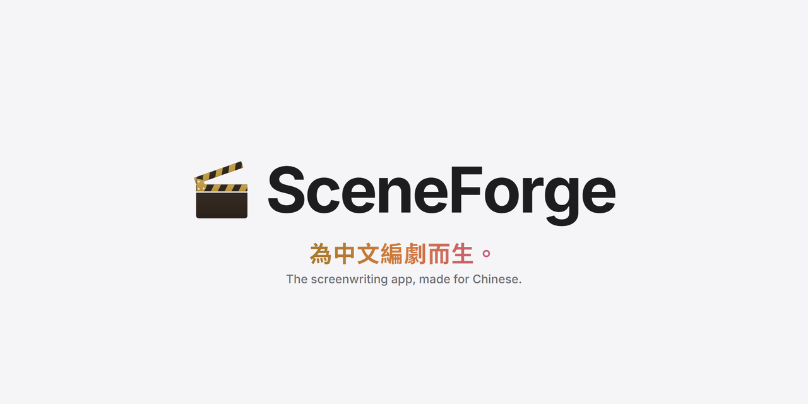
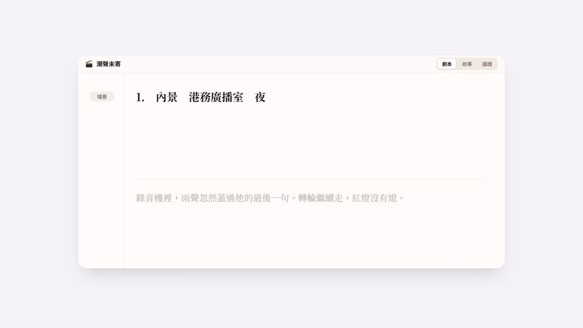

  

  
  

# SceneForge

**為中文編劇而生的劇本寫作軟體。** 用注音打字不會亂跳格式，台式、美式劇本隨時切換；從一句話故事、分場大綱到伏筆、知情表、人物關係與時間線，寫劇本需要的都在同一個地方。

https://github.com/user-attachments/assets/aac3ecdb-9fd7-43cb-85eb-0604fa9ca0a0

## 為什麼做 SceneForge

台灣常見的劇本格式，動作前面加三角形、角色和對白擠在同一行，讀起來並不好看。好萊塢的國際劇本格式乾淨、好讀，是全世界通用的寫法；可是用那種格式的編劇軟體都是為英文設計的，中文輸入法一按 Enter 就跳段，中文排版也常常不對。

SceneForge 想解決的就是這件事：讓中文劇本也能用國際格式來寫，注音打字順手、中文排版正確，匯出的 PDF 就是標準的好萊塢版面。而且免費、開源。

## 特色

### ⌨️ 注音友善的編輯器

組字時不會誤觸格式切換；場景、動作、角色、對白自動成形，場景標題與角色名自動補全。

### 📄 國際格式，中文也漂亮

用好萊塢標準格式（US Letter、角色置中、對白縮排）寫中文劇本，字距與分頁都正確。需要時也能隨時切換成簡潔的台式版面（A4、場次號在前、角色：對白），內容不變，頁數與片長自動重算。

### 📥 匯入就能接著寫

Word、PDF、Final Draft（FDX）、Fountain、Markdown、純文字都能轉成劇本。辨識錯了點一下就能修正，修正會被記住，下次匯入更準。

### 🧭 先看清整個故事

一句話故事、故事大綱、故事核心三欄寫清楚方向；分場大綱卡片可拖曳排序、標顏色。

### 🧵 伏筆與設定追蹤

記下每條伏筆在哪一場埋下、哪一場回收，未回收的一眼就看得到；需要前後一致的設定也有出處可查。

### 🕵️ 知情表

每個秘密由觀眾與各角色在第幾場得知，自動標出懸念（觀眾先知道）與謎團（角色先知道）。

### 🕸️ 人物關係圖與心智圖

關係會隨劇情改變，可指定從第幾場起生效；心智圖可一鍵從劇本生成，再自由整理靈感。

### ⏳ 雙軸時間線

觀眾看到的順序與事件真正發生的順序並排比對，倒敘、插敘一目了然。

### 📤 專業匯出

PDF（內嵌字型、專業分頁）、Word、Final Draft、Fountain、純文字；可加封面、場次編號，也能匿名投稿。

## 下載

到 [Releases](https://github.com/kane1a/SceneForge/releases/latest) 下載：

| 檔案 | 說明 |
|---|---|
| `SceneForge-Setup-<版本>.exe` | Windows 安裝版（個人安裝，不需管理員權限） |
| `SceneForge.exe` | Windows 免安裝版，資料存放在 exe 旁的 `Data`、`Scripts` 資料夾 |
| `SceneForge-<版本>-mac-arm64.dmg` | macOS（Apple Silicon：M1 以後的 Mac） |

- 程式目前沒有數位簽章，第一次執行時 Windows 可能顯示 SmartScreen 提示，點「其他資訊 › 仍要執行」即可。
- Mac 版同樣沒有 Apple 簽章：打開 DMG 後把 SceneForge 拖到「應用程式」，第一次開啟若被擋下，到「系統設定 › 隱私權與安全性」按「仍要打開」。若顯示「已損毀」，在終端機執行 `xattr -cr /Applications/SceneForge.app` 後再開啟。
- 資料位置與解除安裝方式見 [`docs/安裝與資料位置.md`](docs/安裝與資料位置.md)。

## 專案結構

| 路徑 | 說明 |
|---|---|
| [`src/`](src) | 前端：React + TypeScript + Vite，編輯器、故事工具、圖譜 |
| [`server/`](server) | 本機服務：Node 內建 SQLite、PDF 排版、匯入匯出 |
| [`electron/`](electron) | 桌面殼層：視窗、檔案存取權限、安全設定 |
| [`docs/`](docs) | 安裝與資料位置說明 |

想參與開發，請先看 [CONTRIBUTING.md](CONTRIBUTING.md)。

## 支持開發

如果 SceneForge 幫上了你的寫作，歡迎請開發者喝杯咖啡：

## 授權

[MIT](LICENSE) © [kane1a](https://github.com/kane1a)

隨附的字型（Courier Prime、Noto Sans Mono CJK TC 等）採 SIL Open Font License 1.1，見 [`public/fonts/OFL.txt`](public/fonts/OFL.txt)。其他開放原始碼套件的授權可在程式的「關於 › 第三方授權」查看。
